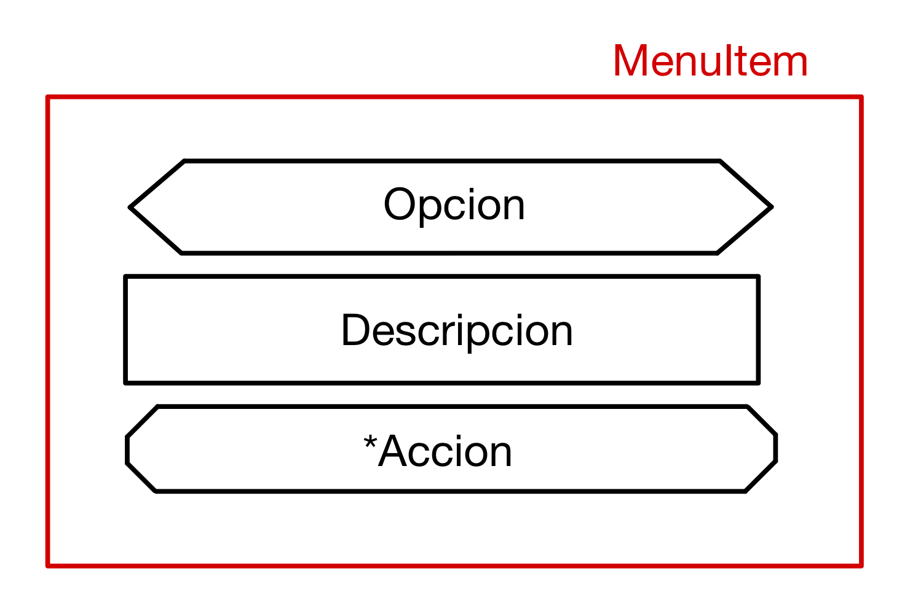
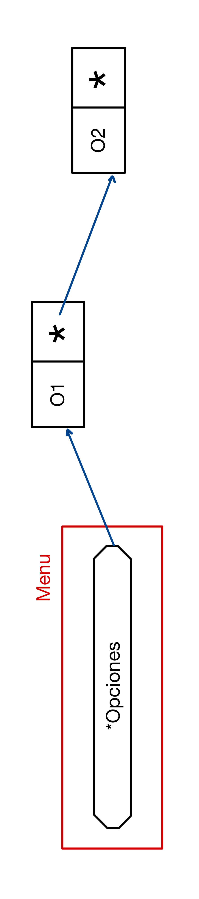
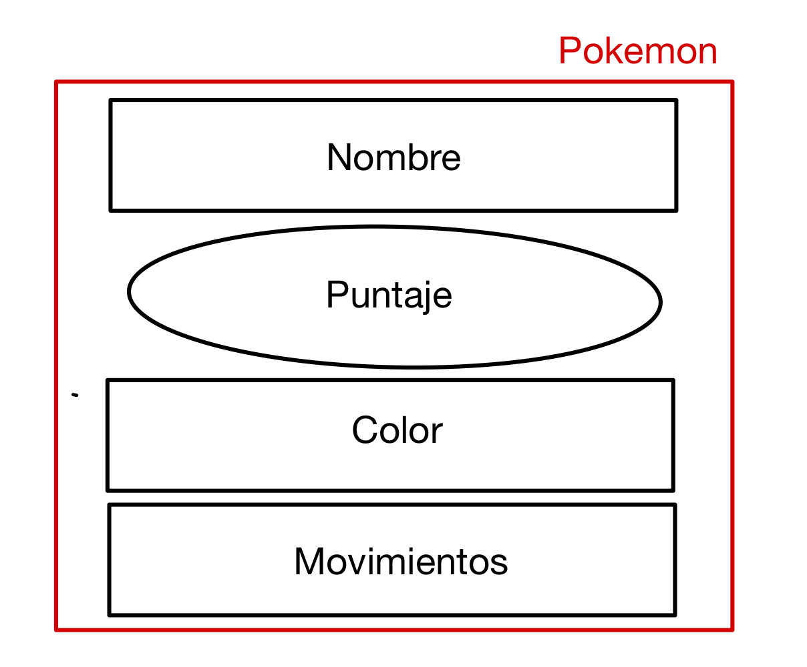
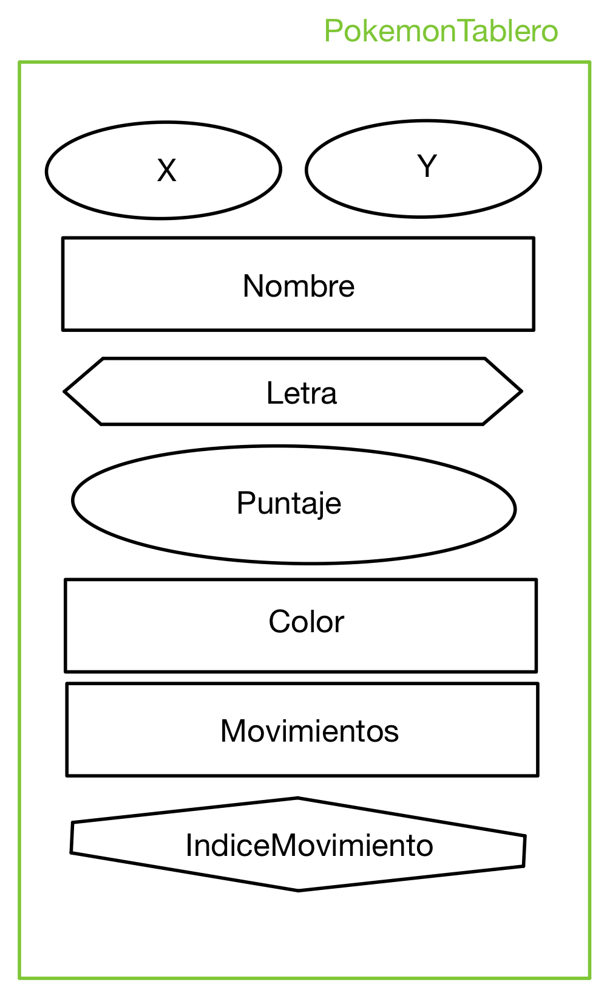
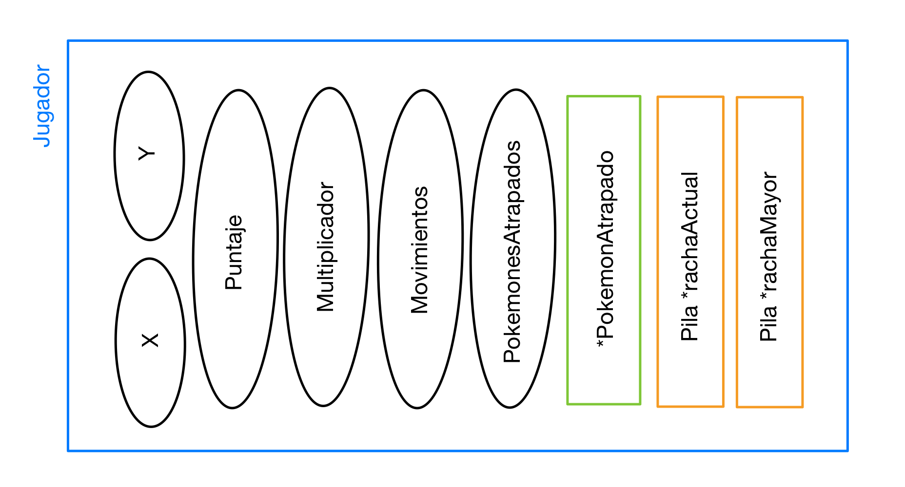
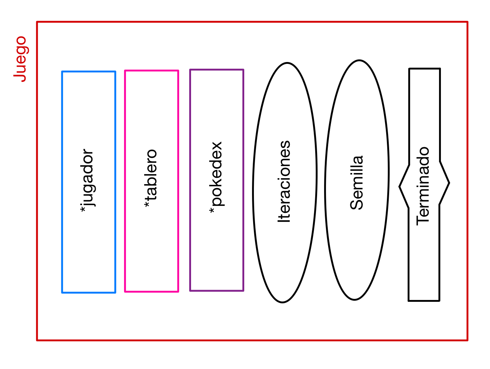
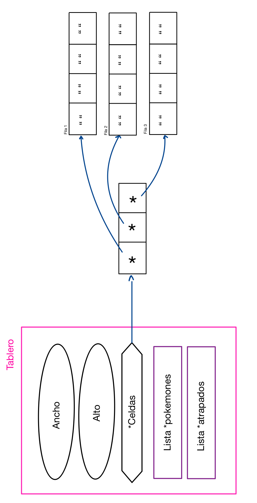
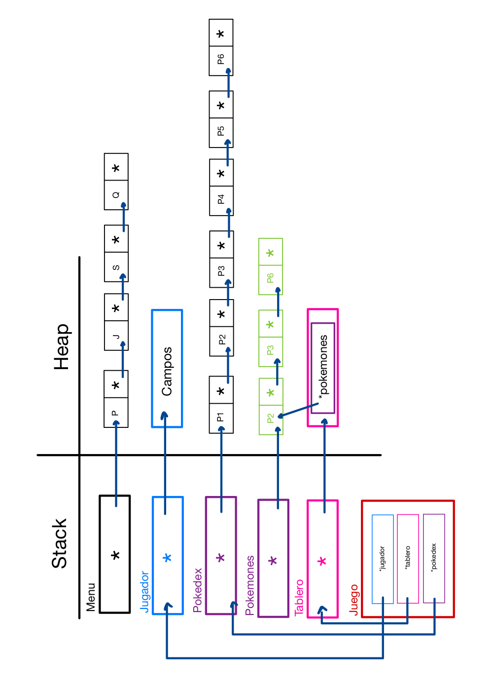

<div align="right">

</div>

# TP 2

## Repositorio de Ivan Emanuel Fabreagt - 112287 - ifabregat@fi.uba.ar

- Para compilar:

Opcion1:
```bash
gcc -Wall -Werror -O2 -g -c extra/engine.c -o engine.o && \
gcc -std=c99 -Wall -Wconversion -Wtype-limits -pedantic -Werror -O2 -g src/*.c tp2.c engine.o -o tp2
```

Opcion2:
```make
make tp2
```

- Para ejecutar:

```bash
./tp2
```

- Para ejecutar con valgrind:
```bash
valgrind --leak-check=full --track-origins=yes --show-reachable=yes --error-exitcode=2 --show-leak-kinds=all --trace-children=yes ./tp2
```

- Para ejecutar pruebas y luego tp2
```make
make
```

---
#  TDAs creados

## Menu

### Estructuras

* **menuItem**: contiene un `char` para la opcion, contiene una `char *` y contiene un puntero a funcion tipo `bool` que recibe como parametro un `void *`.

* **menu**: contiene un puntero a un tipo de dato tipo `lista`.

<div align="center">


</div>

### Funciones
* **menu_crear**: reserva memoria para la variable de tipo `menu`. Despues al campo `opciones` le asigna la `lista` devuelve de la funcion `lista_crear`.

* **menu_destruir**: recibe un puntero al `menu_t` para el menu y un puntero a la funcion `destructor` para aplicarle a cada elemento. Libera la lista del campo opciones utilizando la funcion `lista_destruir_todo` con el destructor pasado por parametro. Despues libera la memoria utilizada para el `menu`.

* **menu_agregar_opcion**: recibe un puntero al `menu_t` para el menu, un `char` para el caracter, un `char *` para la descripcion y un puntero a la `funcion` de tipo bool. Transforma el caracter a mayuscula y lo busca en la `lista` de opciones. Si esta devuelve `false`, caso contrario reserva memoria para un `menuItem` y asigna los valores y devuelve `true`.

* **menu_mostrar**: recibe un puntero al `menu_t` para el menu. Con un for itera hasta el valor retornado por `lista_cantidad_elementos`. En cada iteracion obtiene el elemento `menuItem` de la lista con `lista_obtener_elemento` a traves del indice y lo muestra con determinado formato. Al final aparece un mensaje para que ingrese la opcion (la parte de como pide queda a disposicion del usuario).

* **menu_ejecutar_opcion**: recibe un puntero al `menu_t` para el menu, un `char` para el caracter y un `void *` por si necesitara usarlo. Transforma el caracter a mayuscula y lo busca con la funcion `lista_buscar_elemento`. Si el item no esta devuelve `false`, caso contrario realiza la accion asociada pasandole el `void *` como parametro.

## Pokedex

### Estructuras

* **pokemon**: contiene un `char *` para el nombre, un `int` para el puntaje, un `char *` para el color y un `char *` para el movimiento.



### Funciones

* **pokedex_crear**: creo un puntero a `lista` y le asigno la lista que devuelve la funcion `lista_crear`.

* **pokedex_destruir_todo**: recibe un puntero a la `lista` y un puntero a la funcion `destructor`. Llama a la funcion `lista_destruir_todo` con el destructor pasado como parametro.

* **pokedex_agregar_pokemon**: recibe un puntero a `lista` con la lista de pokemones y un `char *` para la ruta del archivo. Llama a la funcion `abrir_archivo_csv` y pasa la `ruta` del archivo y el separador `,`. Asigno los parseadores a la `funcion parseadores`, generalizo la memoria a pedir que sea de **100 bytes** para los strings y vinculo las variables donde se guardaran esos datos en `ctx`. Con un ciclo while leo cada linea con la funcion `leer_linea_csv`. Convierto el color a su `codigo ansi` para asi poder crear el pokemon con la funcion `pokemon_crear`. Una vez que lo crea, lo agrego al final de la lista. Libero la memoria que pedi para los strings y cierro el archivo con la funcion `cerrar_archivo_csv`. Si todo salio bien devuelve `true`, caso contrario `false`.

* **pokedex_ordenar**: recibe un puntero a `lista` con la lista de pokemones y un puntero a la funcion `comparador` para obtener el criterio de orden. Con el metodo de burbujeo ordena los elementos de la lista utilizando un `void *` temporal para quitar y agregar los elementos en la lista.

* **pokedex_cantidad**: recibe un puntero a `lista` con la lista de pokemones. Llama a la funcion `lista_cantidad_elementos` y retorna su valor.

* **pokedex_obtener_pokemon**: recibe un puntero a `lista` con la lista de pokemones y un `size_t` para la posicion en la lista a acceder. Llama a la funcion `lista_obtener_elemento` y retorna ese dato tipo `pokemon` o `NULL` si no lo encontro.

* **pokedex_obtener_pokemon_random**: recibe un puntero a `lista` con la lista de pokemones. Obtiene la cantidad de elementos de la lista con la funcion `lista_cantidad_elementos` para utilizar la funcion `rand` y limitar los valores. Llama a la funcion `lista_obtener_elemento` y retorna ese dato tipo `pokemon` o `NULL` si no lo encontro.

* **pokedex_iterar_pokemones**: recibe un puntero a `lista` con la lista de los pokemones, un puntero a la funcion `funcion` tipo bool que recibe un `pokemon_t` y un `void *` para usar con el **iterador externo** y por ultimo un `void *` como ctx por si lo necesita. Llama a la funcion de `ordenar_pokedex` y luego retorna el valor de llamar `lista_iterar_elementos`.

## Juego

### Estructuras

* **pokemonTablero**: contiene un `int` para la posicion x, un `int` para la posicion y, un `char *` para el nombre, un `char` para la primer letra, un `int` para el puntaje, un `char *` para el color, un `char *` para el movimiento y un `size_t` para llevar en que caracter del string moviemiento esta.


* **jugador**: contiene un `int` para la posicion x, un `int` para la posicion y, un `int` para el puntaje, un `int` para el multiplicador, un `int` para los movimientos, un `int` para los pokemones atrapados, un `pokemonTablero_t *` para el ultimo pokemon atrapado, un `Pila *` para la pila de pokemones en la racha actual y un `Pila *` para la pila de pokemones en la mayor racha.

* **tablero**: contienen un `int` para el ancho, un `int` para el alto, un `char **` para las celdas, un `Lista *` para los pokemones y un `Lista *` para los pokemones atrapados.

<div  align="center">



</div>

* **juego**: contiene un `jugador_t *` para el jugador, un `tablero_t *` para el tablero, un `Lista *` para la pokedex, un `int` para las iteraciones, un `int` para la semilla y `bool` para validar si se termino el juego.

<div  align="center">

</div>

### Funciones

* **destructor_pokemones_tablero**: recibe un `void *`. Se encarga de liberar la memoria pedida para los datos tipo `pokemonTablero`.

* **tablero_crear**: recibe un puntero a `Lista`. Asigna el alto y ancho a los valores 15 y 32. Reserva memoria para un **char** para cada celda de la matriz (por eso **char ****) y los inicializa con un espacio en blanco con `memset`. Asigna la lista pasada por parametro a lista de los pokemones y crea una lista para los atrapados.

* **tablero_destruir**: recibe un puntero a `tablero_t` y un puntero a la funcion `destructor`. Se encarga de liberar la memoria pedida para cada celda y utiliza la funcion de `lista_destruir_todo` para destruir las listas con el `destructor` pasado.

* **encontrar_pokemon_en_posicion**: recibe un puntero a `Lista` con la lista de los 7 pokemones para el tablero, un `int` con la posicion x y un `int` con la posicion y. Con el **iterador interno** recorre la lista y verifica si el pokemon en esa posicion de la lista coincide con las posiciones pasadas. Si coincide retorna ese dato tipo `pokemonTablero_t`, caso contrario `NULL`.

* **tablero_imprimir**: recibe un puntero a `juego_t` con el juego. Muestra unos datos de interes para el usuario y a continuacion imprime el tablero. Si la posicion de ambos ciclos for coincide con la del jugador o la del pokemon a llamar la funcion de **encontrar_pokemon_en_posicion** imprime el caracter.

* **tablero_eliminar_pokemon**: recibe un puntero a `Lista` con los pokemones, un puntero a `Lista` para los pokemones atrapados y un puntero a `pokemonTablero_t` para el pokemon. Con el **iterador interno** recorre la lista para ver si se encuentra el pokemon pasado, si coincide lo quita y lo agrega al final de la lista de atrapados. Devuelve el `pokemon atrapado` si es que la funcion de `lista_quitar_elemento` lo encontro, caso contrario `NULL`.

* **tablero_agregar_pokemon**: recibe un puntero a `Lista` con la pokedex y un puntero a `Lista` con los pokemones del tablero. Obtiene la cantidad de elementos de la pokedex para asi poder usar la funcion `rand` y que devuelva un numero entre ese rango. Con ese indice averiguo la posicion random de un pokemon de la pokedex, me copio los valores en otras variables las cuales les reservo memoria y agrego al pokemon a lista de los pokemones del tablero.

* **jugador_crear**: reservo memoria para la estructura y asigno los valores iniciales a los campos. Para las rachas uso el tipo de dato `Pila`, permitiendome acceder rapidamente al ultimo ingresado.

* **jugador_destruir**: recibe un puntero a `jugador_t` y un puntero a una funcion `destructor`. Libera la memoria de las **pilas**. Primero verifico si estan vacias, si no lo estan le aplico a cada elemento la funcion `destructor`, caso contrario solo libero la estructura.

* **max**: recibe un int para el primer elemento y un int para el segundo elemento. Devuelve el mayor de los elementos.
* **min**: recibe un int para el primer elemento y un int para el segundo elemento. Devuelve el menor de los elementos.

* **procesar_movimiento_pokemones**: recibe un puntero a `Lista` con la lista de los pokemones del tablero y un `int` con la conversion a ascii de la tecla presionada. A traves del iterador interno recorre la lista de los pokemones del tablero. Aplicandole a cada uno la correccion de los campos posicion x y posicion y dependiendo del campo indice de movimiento que lleva la cuenta sobre el patron de movimiento.

* **procesar_entrada**: recibe un `int` con la conversion a ascii de la tecla presionada, un puntero a `jugador_t` con el jugador y un puntero a `Lista` con la lista de pokemones del tablero. Realiza la correcion de los campos x e y del jugador segun la tecla presionada y llama a la funcion `procesar_movimiento_pokemones`. Utiliza las funciones de `max` y `min` para que no se salga del tablero.

* **administrar_puntaje**: recibe un puntero a `jugador_t` con el jugador y un puntero a `pokemon_tablero_t` con el pokemon atrapado. Si es el primer pokemon atrapado lo agrega a la **pila** de `racha actual`. Despues realiza una comparacion con el ultimo elemento de la `racha actual` con el pokemon atrapado si coinciden letra o color se agrega a la `racha actual`. Caso contrario realiza una comparacion para ver si la `racha actual` tiene mayor cantidad de elementos que la `racha mayor` y acomoda las pilas de rachas. Al final calcula el puntaje.

* **logica**: recibe un `int` con la conversion a ascii de la tecla presionada y un puntero a `void` para los datos. Esta funcion tiene la logica del juego. Verifica si se encuentra un pokemon en la misma posicion del jugador y si es asi lo guarda en atrapado. Aca llama a la funcion `atrapar_pokemon` que recibe un puntero a `juego_t` y un puntero a `pokemonTablero_t` que llamara a las funciones de **administrar_puntaje**, **tablero_eliminar_pokemon** y **tablero_agregar_pokemon**. Tambien verifica que el temporizador no haya llego a 60 ni que la entrada sea 'q' o 'Q' para salir, si esto pasa asigna terminado en `true`. Al final de cada ciclo retorna esta variable ya que si es true (1) termina la funcion `game_loop`.


# TP2

Se utilizan todos los archivos y en consecuencia sus funciones. Se inicializa el menu con las opciones, descripciones y acciones ya definidas. Utilizo dos variables de tipo bool que son interfaz y continuar. El menu se va a mostrar mientras que interfaz sea `true` y cuando se pide el ingreso de la opcion se pasa a la funcion `menu_ejecutar_opcion` la direccion de memoria de continuar. Esta se actualiza a `true` o `false` si esta termina en false significa que interfaz debe ser false y termina el ciclo del menu.

* **mostrar_pokedex**: recibe un puntero a `void` con el contexto. Crea una pokedex con la ruta ya establecida en el codigo y la itera en orden mostrando cada uno con un formato decente. Y asigna a contexto como `true`, ya que se desea volver a mostrar el menu.

* **juego**: realiza las creaciones de lista y carga de estas como asi de algunos valores importantes a la hora de comenzar el juego.

* **sin_semilla**: recibe un puntero a `void` con el contexto. Inicializa la semilla random con time, srand, rand y de nuevo srand. Y llama a juego con esa semilla . Esta funcion contiene la inicializacion de las estructuras y comienzo del juego. Y asigna a contexto como `false`, ya que se desea terminar de mostrar el menu.

* **con_semilla**: recibe un puntero a `void` con el contexto. Pregunta por la semilla y llama a juego pasandole esa semilla. Esta funcion contiene la inicializacion de las estructuras y comienzo del juego. Y asigna a contexto como `false`, ya que se desea terminar de mostrar el menu.

* **salir**: recibe un puntero a `void` con el contexto. Y asigna a contexto como `false`, ya que se desea terminar de mostrar el menu.

<div  align="center">

</div>


# TDAs reutilizados

Principalmente fueron utilizados el de `Lista` y el `Pila`. No son tdas pero fueron desarrollados durante la materias los archivos `split` y `csv`.

Para el menu en un principio decidi utilizar el tda-hash, pero me encontre con el problema del orden y como se mostraria. Entonces lo termine descartando y tome el tda-lista. Para mantener el orden de inserccion a la hora de mostrar y no tener que cambiar la implementacion del tda. Al tener que implementar un menu con 4 opciones no se genera tan costoso las operaciones.

Para la pokedex lo vi como una fusion entre el `tp1` y el `tp_lista`. Directamente lo encare por el lado de una lista. Lo mismo que antes no son tantos los pokemones por lo que no se hace tan costoso. Sin embargo en el medio pense utilizar el tda-hash. Pero encontre el mismo problema del orden. Tendria que buscar una funcion de hash que justo me los ordene o hacer algun metodo de ordenamiento. Por lo cual tendria que cambiar la implementacion del tda. Tambien pense la opcion del ABB pero no termine visualizarla del todo y no me cerro.

Para el juego lo que pense que iba a ser un problema costoso en cuanto a memoria iba a ser lo de las rachas como lista. Por eso utilice el tda-pila, permitiendome obtener el ultimo elemento agregado y que la funcion sea O(1). Algo a destacar de este tda es que sufrio las modificaciones de haber pasado de entrega a re-entrega y despues una "re-re-entrega". Para reducir los errores. 

# Comentario extra

En el secundario empezamos viendo diagramas de flujos, luego pseudocodigo y por ultimo python (muy basico). Y desde ese momento se me hacia muy dificil visualizar un juego hecho en python ya que pensaba "como logro toda la interfaz esa, no se puede". Y me meti en la carrera. Justo hicieron el cambio por lo que tuve pensamiento computacional. Lo que odie el uso de las funciones porque no terminaba de entender el uso del `return` entonces nunca modularizaba. Al final la promocione. Y en Fundamentos de programacion vimos lo basico y me quedo un mal gusto del lenguaje este pensaba que era "viejo" y que hoy en dia hay otros nuevos que sirven para hoy. Tambien la aprobe. Y aca estoy, decidi meterme aca sabiendo que era conocida por la entrega de los tps uno atras del otro. Y me adapte con el primero que tuve problema fue con el `tp1` por el uso de la memoria. La profesora me comento unas cosas y las intente implementar y despues de eso entendi mejor el uso de los `mallocs`, `reallocs` y `frees`. Para el de ABB fui canchero pero tampoco me llevo tan bien con la recursion. Y el de hash me costo ver a que se referia la tabla, pero sacando eso de lado pude. Y para este tp que decir, lo borre y arranque de nuevo 3 veces porque cada vez que implementaba algo nuevo rompia y habia perdia de memoria o accedia a memoria liberada. Por eso por ahi una parte esta media confusa o parece medio innecesaria pero estuve en los pensamientos de "funciona no lo toques". En este momento puedo decir que funciona (lo probe con varias personas a mi alredor desde conocidos de menos de 10 años, hermanas, amigos/as y pareja). 

Finalmente puedo decir, que se me fue el mal gusto a C y le agarre la mano.
